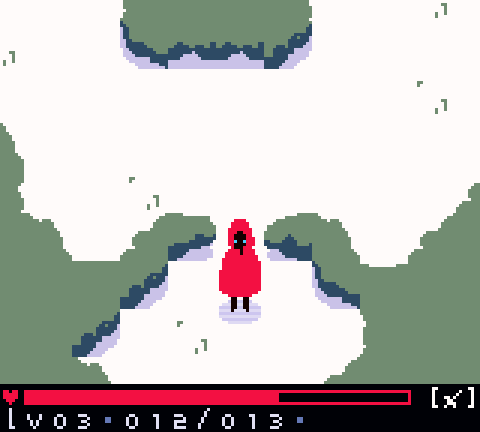

# Red

Still a work in progress. I wanted to see how far I could push the gameboy color system. This project has real potential, but as it's written entirely in LR35902 assembly, progress is slow.

  

# Hardware Requirements

I'm writing this project in assembly language for the Gameboy Color's Sharp LR35902 CPU. The LR35902 is basically a Z80 CPU, with certain instructions and registers removed. The ROM requires a cartridge with an MBC5 memory bank controller, with at least 32kb of cartridge SRAM, and 4mb of cartridge storage. Currently the ROM does not require 4mb of space, but eventually, it probably will.
